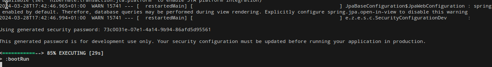
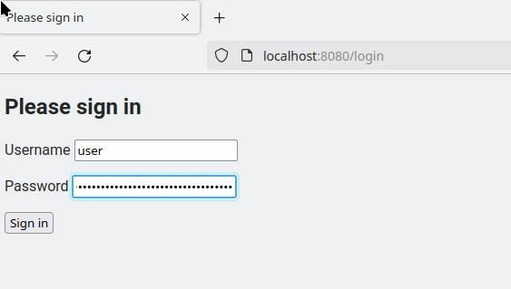
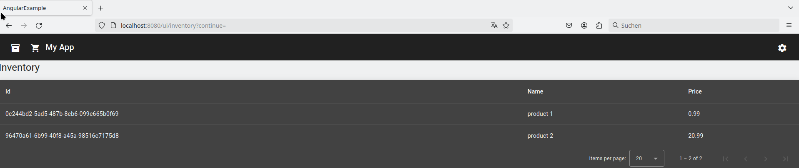

# Introduction - Build

## Prerequisites
You need to have at least JDK 21 (LTS) installed.

Additionally, you need to fulfill the [needs of the frontend](../../frontend/docs/BUILD.md).

# Run application for development
You can run the application for development purposes by entering the subfolder "backend" (if not already done) and executing
```
./gradlew bootRun
```

You can open the application in the browser using http://localhost:8080.

You should login with the username "user" and the random password that is outputted to the console.

.

.

.


# Add test data to application for bootRun
If you need to run the application for development purposes then it is useful to add to the in-memory database some test data so you can properly check your user interface (e.g. listing of all the orders) or for testing some data processing (e.g. order validation).

This data should only be available when running your application locally during bootRun and not when deployed in production. 

Spring boot has a mechanism for this called [data initialization](https://docs.spring.io/spring-boot/docs/current/reference/html/howto.html#howto.data-initialization). In this example, we put a file called [../src/main/resources/data.sql](../src/main/resources/data.sql) in the project that already contains some statements to insert test data. You will also see that exactly the same data can be found when running the application for development.

# Building the application
You can build the application using the following command:
```
./gradlew clean build
```
This also triggers the build of the frontend.

As an output you will have in the folder build/libs multiple jar files. The one called springwebdemo-$VERSION-*.jar contains the full application including an embedded HTTP server, so you can directly run the JAR file and you can directly access the server exposed by it.


# Automated Code Formatting
Having consistend formatting of code is crucial for its understanding by different developers. We employ here a tool that does this automatically for us.

During build the build script checks if the code is formatted according to standards defined in the build script. These standard are defined in the block "spotless".
You can find the possible options in the [Spotless for Gradle](https://github.com/diffplug/spotless/tree/main/plugin-gradle) webpage.

You can automatically fix the formatting of all of the code using
```
./gradlew spotlessApply
```
After it has been executed the build should not fail anymore due to code not formatted according to the defined standard.

# Run tests
Tests are run during a build, but can be also triggered as follows:
```
./gradlew test
```

# Generate Modulith Documentation & Module Testig
During testing, we define certain [ModularityTests](../src/test/java/eu/zuinnote/example/springwebdemo/ModularityTests.java) that
* Check if all modules have a well-defined interface and do not access private classes as well as different module interaction scenarios.
* Generate module documentation (can be found in build/spring-modulith-docs).

More information can found on:
* [Defining Module Interaction Test Scenarios](https://docs.spring.io/spring-modulith/reference/testing.html)
* [Defining formats of the generated module documentation](https://docs.spring.io/spring-modulith/reference/documentation.html)


These tests are executed during the normal build or by running
```
./gradlew test
```

# Database
We do not show it here, but as a good practice which is also recommended by Spring, you should have a tool for database change management so that changes to your database are applied in the same order in all environments.

One of those tools is [Liquibase](https://www.liquibase.com/). It offers also integration with [Spring Boot](https://contribute.liquibase.com/extensions-integrations/directory/integration-docs/springboot/).

Another tool is [Flyway](https://flywaydb.org/).

See [here](https://www.baeldung.com/liquibase-vs-flyway) a comparison between the two.

# Manage Build Tool version - Gradle Wrapper
We use [Gradle Wrapper](https://docs.gradle.org/current/userguide/gradle_wrapper.html) to ensure that the application is build with the correct Gradle version independent which one is installed. This is why we used in the previous commands always "./gradlew" instead of "gradle". 

You can update the Gradle build tool to be used for this project as follows:
```
$ ./gradlew wrapper --gradle-version latest
```

You can verify the version by checking the file [../gradle/wrapper/gradle-wrapper.properties](../gradle/wrapper/gradle-wrapper.properties).

# Update Dependencies
It is very important to keep your dependencies up-to-date to make your project secure and maintainable.

You can check if there is an update to your dependencies by running:
```
./gradlew dependencyUpdates
```

The command has also other features (e.g. generate a report in different formats). Please check directly [its documentation](https://github.com/ben-manes/gradle-versions-plugin).

Note: If your dependency has reached end-of-life (EOL), ie it is not maintained anymore, then this will command will NOT inform you. You need then check regularly if you dependencies have reached end-of-life and find alternatives yourself.