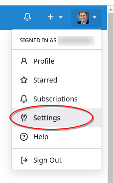
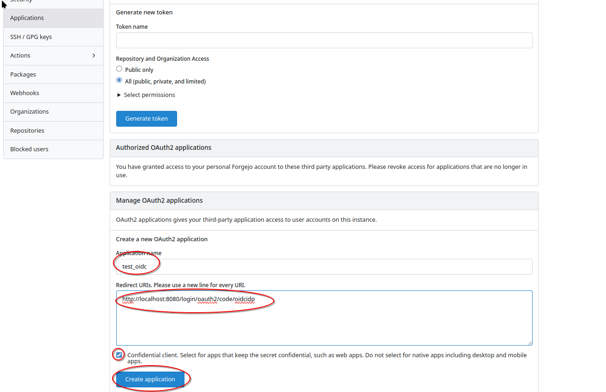
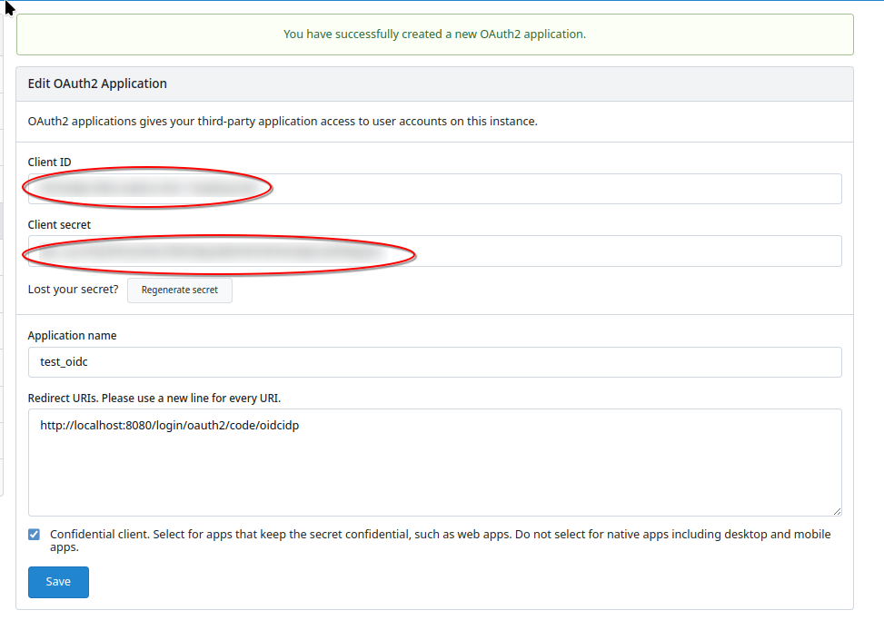
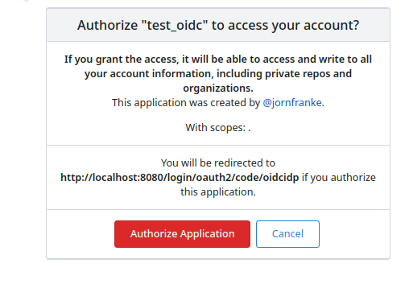

# Introduction

We describe here how you can configure with the example application an IdP that supports the OIDC Authorization Code Flow. We use here Codeberg.org (https://codeberg.org), because it is free and open source. You will need to create an own user account on Codeberg.org (Simply click on Register on the top right). Any user of your app would need to have also a Codeberg.org account (of course if you have a different IdP then they need to have an account with a different IdP).

However, you can use any IdP or platform that supports OIDC. Please look into their indivdual documentation as registering an application in the IdP differs, but in the background all use OIDC

# Registering a new application with Codeberg.org

After logging into Codeberg.org you need to register a new application. Click on your user profile on the top right and select "Settings".

.

Afterwards click on the left on "Applications". Scroll a bit down to the section "Manage OAuth2 applications" and enter the information for the application.

.

We enter in this example:

Application name: Test OIDC

Redirect URIs: http://localhost:8080/login/oauth2/code/oidcidp


The application name can be anything.

The redirect URI is the URL of your application under which it receives from the OIDC IdP the OIDC code to request tokens etc. We define in this example a localhost URL, which is the URL of the application if you use ```./gradlew bootRun``` to start it.

If you deploy your application to production (see also [OPERATIONS.md](./OPERATIONS.md)) it has a dedicated hostname and thus a dedicated URL, which you need to configure.

Afterwards click on "Create Application".

.

Codeberg.org will tell you the client id and client secret for the application (we redacted them here, because you should keep them confidential and share with no one!).

They need to be configured for the application (see [CONFIGURE.md](./CONFIGURE.md)).

# Try it out

After you have configured client id and client secret you can run the application as described in ([BUILD.md](./BUILD.md)). This runs it as a local application for development purposes with OIDC enabled:
```
./gradlew bootRun --args='--spring.profiles.active=oidc --spring.security.oauth2.client.registration.oidcidp.redirect-uri={baseUrl}/login/oauth2/code/oidcidp --spring.security.oauth2.client.registration.oidcidp.authorization-grant-type=authorization_code --spring.security.oauth2.client.registration.oidcidp.client-id=<CLIENT_ID> --spring.security.oauth2.client.registration.oidcidp.client-secret=<CLIENT_SECRET> --spring.security.oauth2.client.registration.oidcidp.client-authentication-method=client_secret_post  --spring.security.oauth2.client.provider.oidcidp.issuer-uri=https://codeberg.org/  ---application.oidc.mapper.userAttributes=groups --application.oidc.mapper.claimsSeparatorMap.groups=, --application.oidc.mapper.authoritiesPrefix=ROLE_ --application.https.disableRedirectHttps=true'
```

You need to replace <CLIENT_ID> and <CLIENT_SECRET> with the credentials you obtained in the previous step.

Note: Some of the settings are only for local development and not production deployments. As said before, they are also specific to codeberg.org and they may vary for your IdP.

Navigate to http://localhost:8080

You will be redirected to Codeberg.org and asked to login with your Codeberg.org credentials (if you are not logged in already).

Aferwards you as a user need to approve that the application has access to your user information (Otherwise anyone could get your information!):

.

You can revoke at any time this access by going to Settings/Applications/Revoke access.

If you have authorized the application then you will see the application running.


You will see in the default configuration mapped_roles only if you are member of an [organization in Codeberg](https://docs.codeberg.org/collaborating/create-organization/). For example, you can create an own organization or someone else adds you to an existing organization. 

Please note that every IdP can have different claims, e.g. Codeberg.org provides the roles in the claim "groups", but other IdPs may use different claim names.

# Deleting the application on Codeberg.org

If you currently do not develop or have no application deployed then it is strongly recommended to delete it from Codeberg.org to avoid abuse.

Go to the page where you created the application (Settings/Applications) and select "Remove" for the corresponding application.


# Some further information about Codeberg.org OIDC Support

You can find under the default OIDC discovery endpoint all OIDC options that codeberg.org supports:

https://codeberg.org/.well-known/openid-configuration

Please check also the Forgejo documentation (Codeberg.org is a Forgejo deployment) on OAuth2 provider:
https://codename.codeberg.page/@main/docs/latest/user/oauth2-provider
