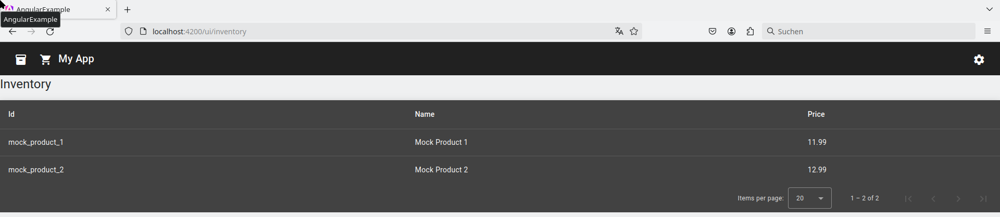

# Introduction - Build

## Prerequisites

You need to have at least NodeJs 20 installed. We recommend to always use the last Long-Term-Support (LTS) version of NodeJs

## Install dependencies

You can install all the dependencies using the following command:

```
npm install
```

If you want to have an exactly reproducible build then you should use instead:

```
npm ci
```

# Run the frontend locally for development purposes

You can run the frontend (without the backend) using the following command:

```
npm run start
```

You can open the Angular frontend without the backend in a browser using the url: http://localhost:4200

.

# Add test data to the front end for test purposes

Since the frontend is run without backend, you need to let the Angular services return some mock data without actually connecting to the backend as it does not run.

This mock data is defined in the folder [../src/app/mockdata/](../src/app/mockdata/). You can add there more test data.

# Build the frontend

You can buld the frontend using the following command:

```
npm run build
```

# Format the code

Having consistend formatting of code is crucial for its understanding by different developers. We employ here a tool that does this automatically for us.

We use here [Prettier](https://prettier.io/docs/en/) for the typescript code and other files.

The file [../.prettierignore](../.prettierignore) contains all references to folders/files that should not be automatically formatted.

The file [../.prettierrc)](../.prettierrc) allows you to [configure Prettier](https://prettier.io/docs/en/configuration).

You can automatically format all code using the following command:

```
npm run fmt
```

# Update the dependencies

You can use the following command to update the dependencies:

```
npm update --save
```

Note you can update to the latest Angular minor versions using:

```
./node_modules/.bin/ng update @angular/cli@<VERSION> @angular/core@<VERSION>
```

where <VERSION> is the current Angular major version you are using (e.g. 18).

For upgrading Angular major versions see the Angular update page: https://angular.dev/update-guide
